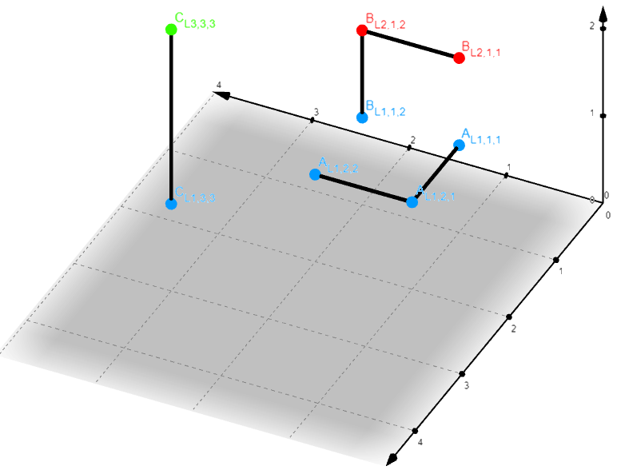
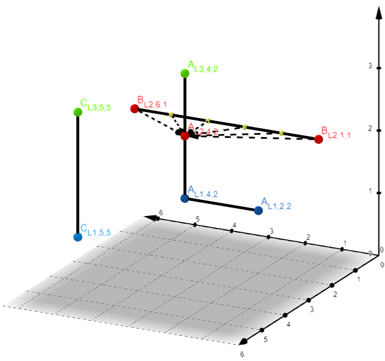
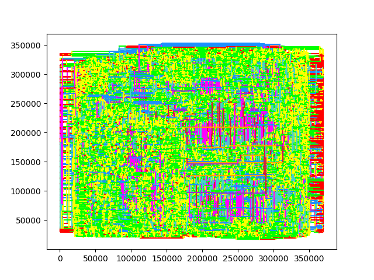

# Net Minimum Distance Finder   
This tool computes minimum distances between nets of a circuit layout by parsing **the corresponding section** of a given [DEF](https://en.wikipedia.org/wiki/Design_Exchange_Format) file. 

The parsing is done by the `net_parsing.py` package that contains the respective grammar, transformer and the generated dataclasses that store the parsed content. The tool is using [Lark](https://lark-parser.readthedocs.io/en/latest/index.html) as an underline engine to parse the `larl` grammar of the NETS subsection of the DEF file.

## Usage
```
usage: nets_finder.py [-h] -u FUNCTIONAL_UNIT -f xxx.def [-o xxx_pair.map] [-m {accurate,relaxed,insane}]

optional arguments:
  -h, --help            show this help message and exit
  -u FUNCTIONAL_UNIT, --functional_unit FUNCTIONAL_UNIT
                        Specifies the targeted functional unit
  -f xxx.def, --def_file_name xxx.def
                        Input .def file
  -o xxx_pair.map, --output_file xxx_pair.map
                        Output file 'xxx.map'
  -m {accurate,relaxed,insane}, --grouping_mode {accurate,relaxed,insane}
                        Net grouping approach
```

- The `-u`  argument is used to specify the hierarchy of a sub-module of the circuit. Only the nets, whose name matches the given one are considered for the computations that follow.
- The `-f` argument specifies the input `.def` file.
- The `-o` optional argument specifies the output file in which the results will be written. By default this file is `pair.map`
- The `-m` argument specifies the algorithm employed for the computation of the minimum distances for each net of the functional unit.

#### Mode `relaxed`:
Relaxed is based on the assumption that the initial routing point of each net is the point in which the net "begins". It considers each net to be a point and computes the closest neighboring net ONLY in the same metal layer. This is a simplified approach.

>Example:


Three routed nets (A,B,C) are depicted above with their initial routing point statement represented with the enlarged point. Color is used to distinguish between metal layers:
- layer1: blue
- layer2: red
- layer3: green 

Let's assume that we intend to find the closest net to net **A**. With the relaxed option, the tool will respond with **C** because it only considers points in the same metal layer and only starting point coordinates for the wiring segment.

#### Mode `accurate`: 
This mode is the default. For each wiring statement of each net it computes the closest one (and thus the closest neighbour) on the same metal layer. Finally, it returns the net-pair whose corresponding wires were found to be the closest i.e., the minimum distance between wiring statements. 


>Example:


This is the same case as the previous one. Once again, we intend to find the closest net to net **A**. With the accurate option the tool will consider every point (although in the same metal layer only again) and will respond with **B** being the closest one i.e., point $B_{L_1,1,1}$. 

#### Mode `insane`: 
The insane mode is an enhancement of the previous mode. The approach is the same but each wiring segment of each net is splitted into smaller metal strips.

>Example:


In the same set of nets (A,B,C) let's now assume that we intend to calculate the closest net to net **B**. With this option, The metal strip of net B gets broken-down to a combination of new metal strips. Each of the newly generated points (marked with yellow) are now considered as well instead of just looking at starting and ending points of the wiring statement. This approach although only concerns neighboring nets in the same metal layer only can give the most accurate results at the cost of computational time.

## Notes:
1. The `SUBNET` region of the nets is currently not implemented in the grammar. Parsing `.def` files whose net region contains such statements will result into runtime errors.
2. The tool contains also a debug function to plot the nets of the parsed file resulting in a planar TOP view of the nets wiring per metal layer. 
Example:



